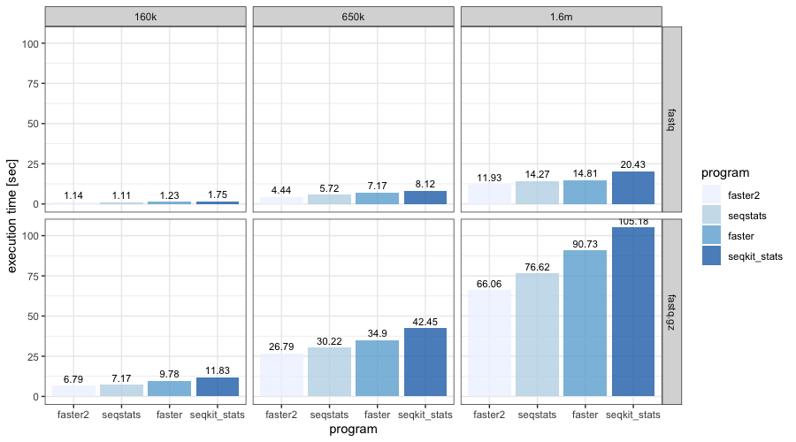

# faster2
Ultra-fast summary for fastx files

## Description

This is a stripped-down version of my other Rust program, [faster](https://github.com/angelovangel/faster), with less functionality but focused on speed. It is arguably the fastest tool that gives summary information about fastq files. The program uses the [`kseq`](https://github.com/moold/kseq) library for reading fastx files and outputs various summary metrics.

## Compile

A linux executable can be downloaded from the release section. Compiling for other platforms see below.

```bash
curl --proto '=https' --tlsv1.2 -sSf https://sh.rustup.rs | sh
git clone https://github.com/angelovangel/faster2.git

cd faster2
cargo build --release

# the binary is now under ./target/release/, run it like this:
./target/release/faster2 -t /path/to/fastq/file.fastq.gz
````

## Usage and benchmarks

```bash
# simple
faster2 -t file.fastq

# the query file can be fasta, fastq, fastq.gz...
```

The benchmarks were performed with sampled Nanopore ([Zymo mock community dataset](https://github.com/LomanLab/mockcommunity)) data using [hyperfine](https://github.com/sharkdp/hyperfine). `faster2` was compared to [`faster`](https://github.com/angelovangel/faster), [`seqkit stats`](https://bioinf.shenwei.me/seqkit/) and [`seqstats`](https://github.com/clwgg/seqstats).


